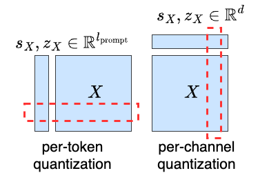
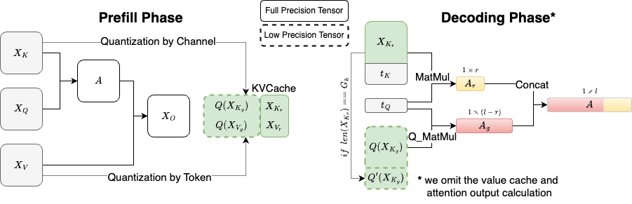

# KIVI: A Tuning-Free Asymmetric 2bit Quantization for KV Cache - LMEval branch

Implementation of [KIVI: A Tuning-Free Asymmetric 2bit Quantization for KV Cache](https://arxiv.org/abs/2402.02750)

Use lm-eval to evaluate model on downstream tasks (e.g. GSM8K, Coqa, etc.):
```bash
cd lm-evaluation-harness
pip install -e .
cd ..

# We report TASK in {coqa, truthfulqa_gen, gsm8k} in our paper.
# If use KIVI implementation, set K_BITS and V_BITS to 2 or 4.
# If use baseline, set K_BITS and V_BITS to 16.
bash scripts/lmeval_test.sh {GPU_ID} {K_BITS} {V_BITS} {GROUP_LENGTH} {RESIDUAL_LENGTH} {TASK} {MODEL_NAME}
```

## Overview

KIVI is a new plug-and-play 2bit KV cache quantization algorithm without any fine-tuning. This algorithm optimizes memory usage by quantizing the key cache per-channel and the value cache per-token to 2bit. KIVI's hardware-friendly design allows LLMs like Llama-2, Falcon, and Mistral to maintain comparable quality levels while reducing peak memory usage by 2.6 times. This enables up to 4 times larger batch sizes and significantly increases throughput by 2.35 to 3.47 times in real LLM inference workloads, effectively addressing the bottleneck issues in speed and memory usage.

Illustration of KIVI quantization scheme: key cache per-channel and value cache per-token.
<p align="center">

</p>

Illustration of KIVI algorithm during inference prefill and decoding phase:
<p align="center">

</p>

## How to use KIVI

### Setup

To install the required packages:

```bash
conda create -n kivi python=3.10
conda activate kivi
pip install --upgrade pip  # enable PEP 660 support
pip install -e .
```

Then install our CUDA implementation:

```bash
cd quant && pip install -e .
```

### Example

Load KIVI-quantized model: (e.g., Llama-2-7b)

```python
# LLaMA model with KIVI
import torch
import os
from models.llama_kivi import LlamaForCausalLM_KIVI
from transformers import LlamaConfig, AutoTokenizer
config = LlamaConfig.from_pretrained("meta-llama/Llama-2-7b-hf")

config.k_bits = K_BITS # current support 2/4 bit for KV Cache
config.v_bits = V_BITS # current support 2/4 bit for KV Cache
config.group_size = GROUP_SIZE
config.residual_length = RESIDUAL_LENGTH # the number of recent fp16 tokens
CACHE_DIR = PATH_TO_YOUR_SAVE_DIR

model = LlamaForCausalLM_KIVI.from_pretrained(
    pretrained_model_name_or_path='meta-llama/Llama-2-7b-hf',
    config=config,
    cache_dir=CACHE_DIR,
    torch_dtype=dtype,
    low_cpu_mem_usage=True,
    device_map="auto",
)

tokenizer = AutoTokenizer.from_pretrained(
    'meta-llama/Llama-2-7b-hf', 
    use_fast=False, 
    trust_remote_code=True, 
    tokenizer_type='llama')

# Inference
# e.g., model.generate(...)
```

We use GSM8K as an example to show how to use KIVI. You can check [example.py](./example.py):

```bash
python example.py
```

Evaluate KIVI on LongBench:

```bash
bash scripts/long_test.sh {GPU_ID} {K_BITS} {V_BITS} {GROUP_LENGTH} {RESIDUAL_LENGTH} {MODEL_NAME}
```

## Citation

If you find our method useful, please kindly cite our paper.

```bibtex
@article{liu2024kivi,
  title={KIVI: A Tuning-Free Asymmetric 2bit Quantization for KV Cache},
  author={Liu, Zirui and Yuan, Jiayi and Jin, Hongye and Zhong, Shaochen and Xu, Zhaozhuo and Braverman, Vladimir and Chen, Beidi and Hu, Xia},
  journal={arXiv preprint arXiv:2402.02750},
  year={2024}
}
```

## Contributing
We welcome contributions from the research community to improve the effeicency of KIVI. If you have any idea or would like to report a bug, please open an issue or submit a pull request.

## License
The code is released under the MIT License.
